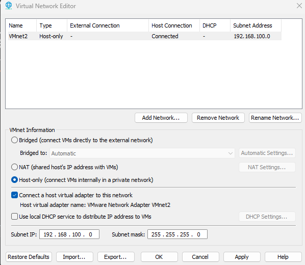
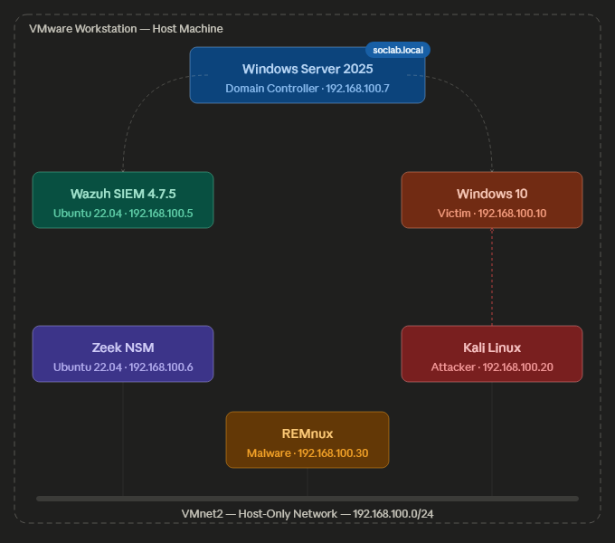

# Home SOC Lab

A production-relevant Security Operations Center lab. Covers Active Directory administration, SIEM deployment,
threat detection, and incident response.

## Lab Status
| Phase | Component | Status |
|-------|-----------|--------|
| 1 | Active Directory (Windows Server 2025) | See [My AD Lab Repo](https://github.com/jjlocke2004/active-directory-lab) |
| 2 | SIEM — Wazuh 4.7.5 on Ubuntu 22.04 | ✅ Complete |
| 3 | Windows 10 Endpoint - Victim Machine | ✅ Complete |
| 4 | Network Monitoring — Zeek |  ✅ Complete|
| 5 | Attack Simulations — Kali Linux | 🔄 In Progress |
| 6 | IR Playbooks | ⏳ Planned |

## Lab Network Configuration

All VMs communicate over a VMware host-only network (VMnet2) isolated 
from the host machine's real network. This ensures attack traffic 
never reaches outside the lab environment.

| Setting | Value |
|---------|-------|
| Network | VMnet2 — Host Only |
| Subnet | 192.168.100.0/24 |
| DHCP | Disabled — all VMs use static IPs |

## Environment and Architecture Diagram
| VM | OS | Role | IP |
|----|----|------|----|
| WinServer-DC | Windows Server 2025 | Domain Controller | 192.168.100.7 |
| Wazuh SIEM | Ubuntu 22.04 LTS | SIEM / Dashboard | 192.168.100.5 |
| Win10-Victim | Windows 10 | Endpoint / Domain Member | 192.168.100.10 |
| Kali Linux | Kali Rolling | Attacker | 192.168.100.20 |
| REMnux | REMnux 7 | Malware Analysis | 192.168.100.30 |

## Phase breakdown

- **[01-active-directory](assets/01-active-directory/README.md)**  
  Deployment of the lab domain, OU structure, users, groups, and baseline Group Policy configuration.

- **[02-siem-wazuh](assets/02-siem-wazuh/README.md)**  
  Installation of the Wazuh SIEM stack and integration with Active Directory telemetry.  
  This phase covers the Ubuntu-based Wazuh deployment, agent installation on Windows systems, domain controller log collection, and validation of security events in the Wazuh dashboard.

- **[03-windows-endpoint](assets/03-windows-endpoint/README.md)**  
  Built and configured Windows 10 victim machine, including endpoint logging and monitoring preparation.

- **[04-network-monitoring](assets/04-network-monitoring/README.md)**  
  *IN-PROGRESS* - Network-level visibility for the lab environment, including traffic capture and monitoring considerations.

- **[05-attack-simulations](assets/05-attack-simulations/README.md)**  
  *PLANNED* - Controlled attack simulations used to validate detections and generate meaningful telemetry.

- **[06-ir-playbooks](assets/06-ir-playbooks/README.md)**  
  *PLANNED* - Detection and response procedures developed from the alerts and artifacts produced in the lab.

## Technologies & skills

- Windows Server 2025 Active Directory
- Wazuh SIEM deployment and agent management
- Windows endpoint monitoring
- PowerShell and Linux administration
- Detection engineering and incident response documentation

## How to navigate this repository

- Start with **[01-active-directory](assets/01-active-directory/README.md)** to understand the domain design.
- Continue to **[02-siem-wazuh](assets/02-siem-wazuh/README.md)** for SIEM deployment and AD log integration.
- Use the remaining numbered folders for endpoint configuration, network monitoring, attack simulation, and response documentation.
