# Phase 1 — Active Directory

## Objective
Built a Domain Controller on Windows Sevrer 2025 to simulate a 
realistic enterprise Active Directory environment. This forms the identity
foundation of the lab. Every phase following this depends on the users, groups,
and policies configured here.

## Components
- **VM:** WinServer-DC
- **OS:** Windows Server 2025 Data Center Evaulation (Desktop Experience)
- **Role:** Domain Controller
- **Domain:** soclab.local
- **IP:** 192.168.100.7
- 
## Architecture Blueprint Diagram
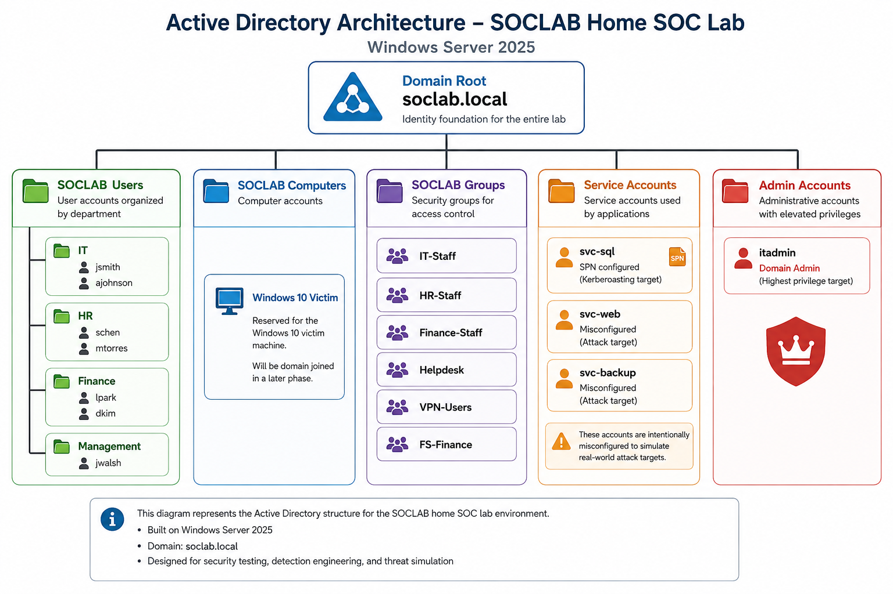

## Steps Taken
**1. Deployed Windows Server 2025 VM in VMware** -
Created new VM with 3GB RAM, 60GB disk, and connected it to the VMnet2 host-only network. 
Assigned a static IP and pointed DNS at itself in preparation for AD DS promotion

**2. Promoted server to domain controller** -
Installed the AD DS role using Powershell and promoted the server to a domain controller, 
creating the soclab.local forest

**3. Built the OU structure** -
Created a realistic organizational unit structure mirroring how a small company 
would organize Active Directory. Made department OUs nested under a top-level SOCLAB Users OU,
with seperate OUs for admin accounts and service accounts.

**4. Created user accounts** -
Created 9 user accounts across four departments - HR, Finance, IT, and Management.
Accounts were created with varying privilege levels including standard users, helpdesk stadd,
a domain admin, and 3 service accounts. Some accounts were intentionally misconfigured to serve 
as attack tagets in later phases.

**5. Created security groups and assignmed members** -
Built 6 security groups covering department membership, helpdesk access, VPN permissions, and file share access.
Members were assignmed to reflect realistic job function access.

**6. Configured audit policies** -
Enabled granular audit logging across Kerberos, Account Management, directory service accounts, and logon events.
These policies are what allow Wazuh to detect AD-based attacks in later phases.

## Screenshots
### Domain Controller Setup
*Assigned a static IP of 192.168.100.7 to ensure consistent addressing across the lab.*

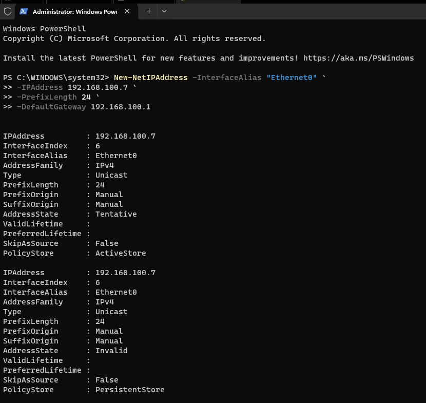

*Configured the DC to point DNS at itself, which is required for Active Directory to function correctly.*

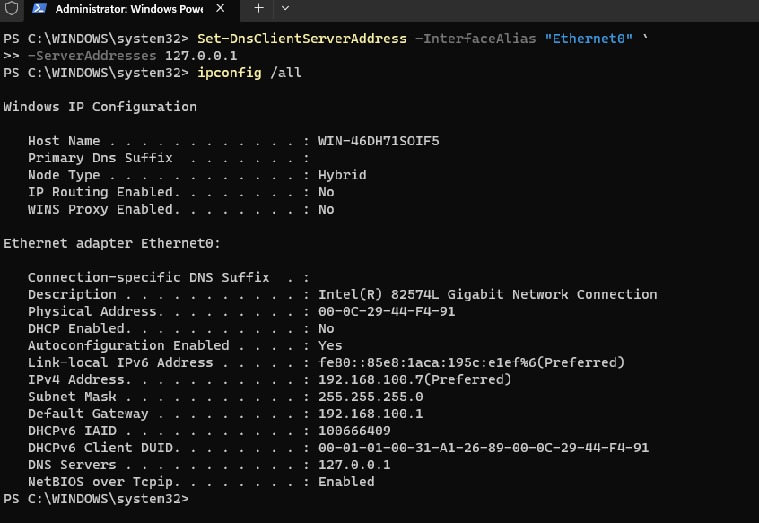

*Installed AD DS*

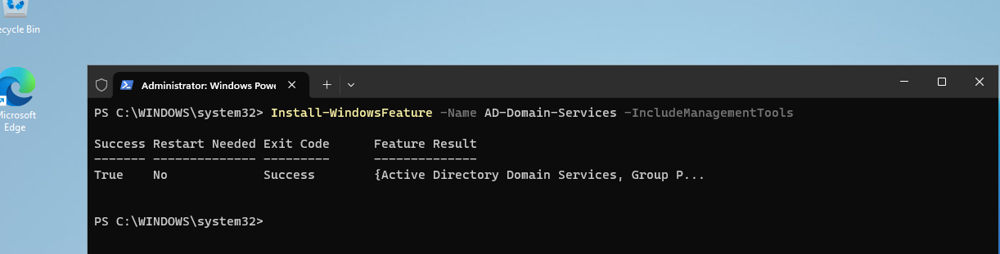

*Installed the AD DS forest and promoted the server to a domain controller, creating the soclab.local forest.*

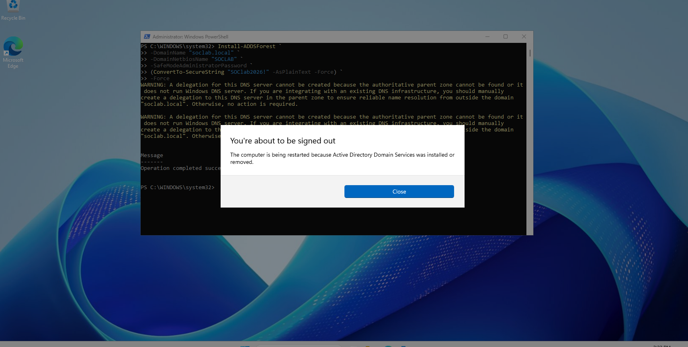

*Confirmed the domain controller is live and soclab.local is fully operational.*

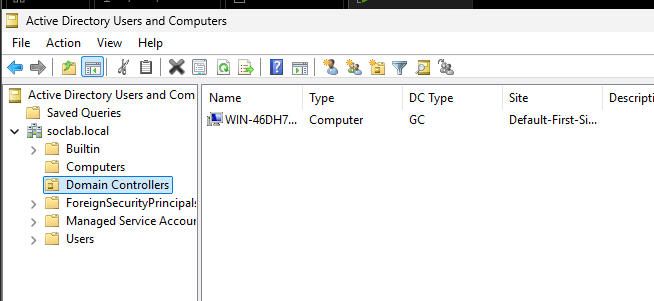

### OU Stucture
*Created the top-level organizational units via PowerShell to mirror a real enterprise AD structure.*

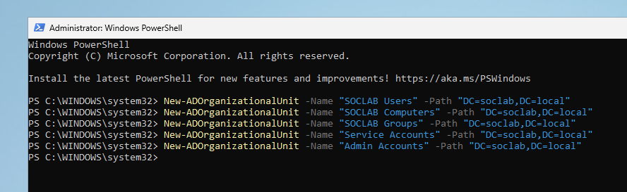

*Added department sub-OUs under SOCLAB Users to organize accounts by job function.*

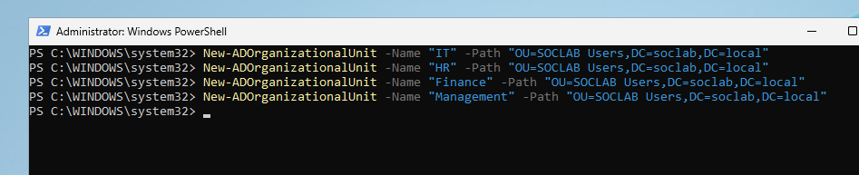

*Verified the finished OU hierarchy in Active Directory Users and Computers.*

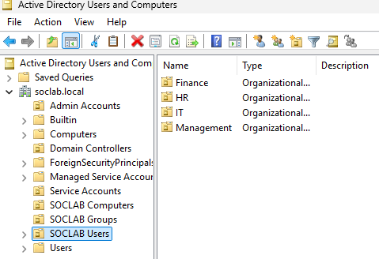

### User Accounts 
*Created department user accounts via PowerShell with attributes including title, department, and email.*

*Example Below is me creating HR users - did the same for each deparment*

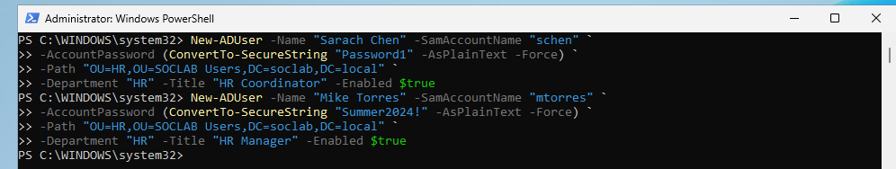

*Verified all users were present in Active Directory Users and Computers and in their respective department OUs.*

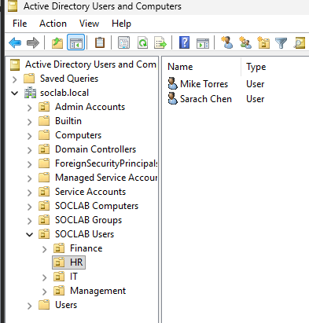

*Created the itadmin account and elevated it to Domain Admin to simulate a privileged target.*

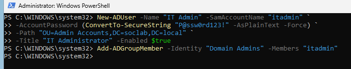

*Verified admin account was present and in the correct OU.*

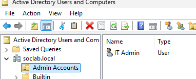

### Service Accounts
*Created svc-sql with a Service Principal Name set, intentionally making it Kerberoastable for Phase 6.*

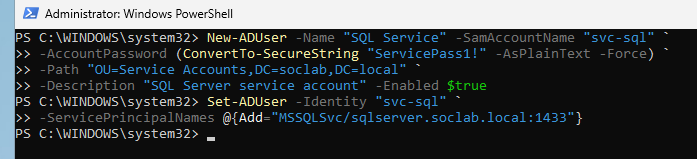

*All three service accounts visible in the Service Accounts OU with descriptions confirming their roles.*

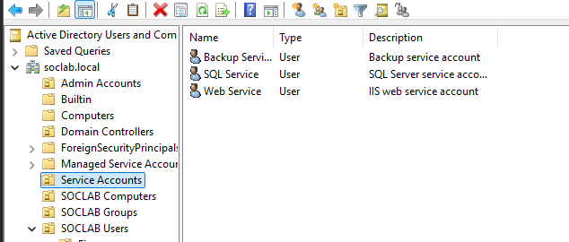

### Security Groups and Membership
*Created six security groups covering department access, VPN permissions, and file share rights.*

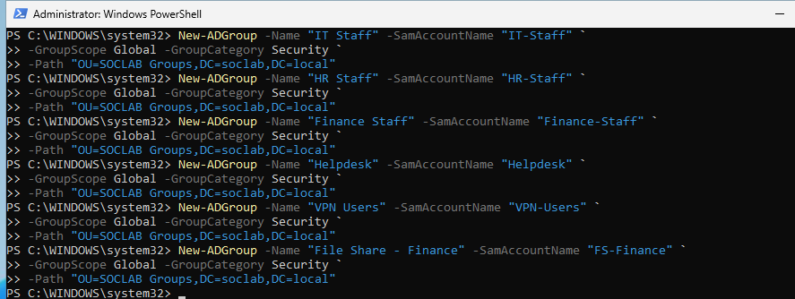

*Assigned users to groups via PowerShell to reflect realistic job function based access.*

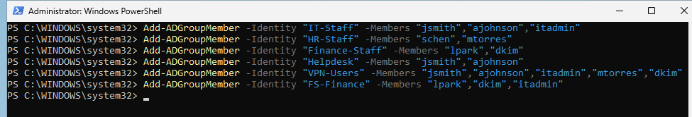

*Confirmed group membership in the GUI showing users correctly assigned across all six groups.*

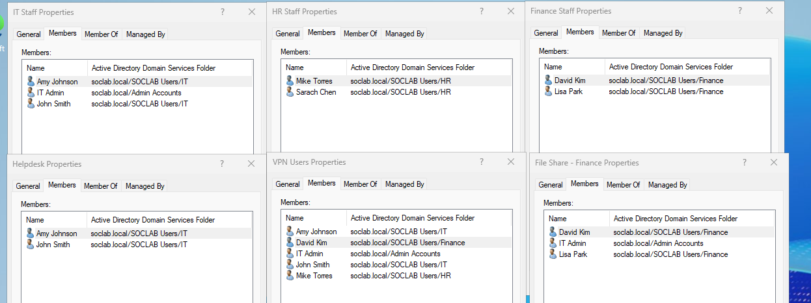

### Group Policy
*Configured a domain-wide password policy enforcing minimum length, complexity, and expiration.*

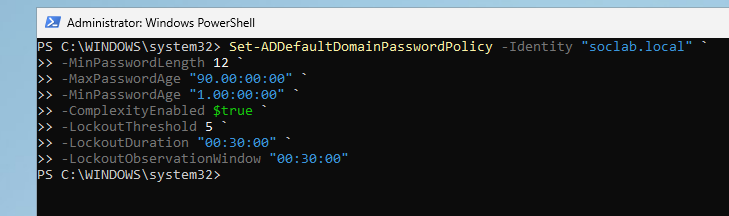

*Created an account lockout GPO to lock accounts after five failed attempts, linked to the domain.*

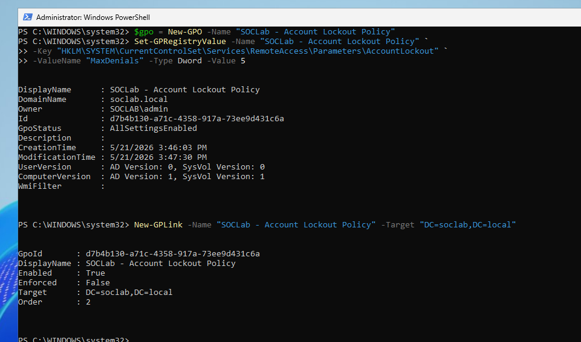

*Created a GPO to restrict local admin abuse, linked to the SOCLAB Computers OU.*

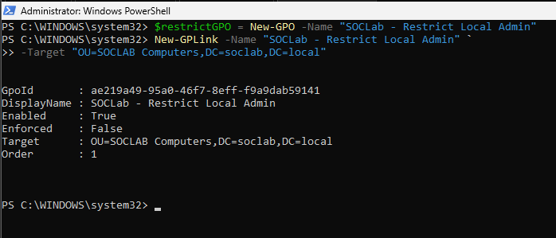

### Audit Policy
*Enabled granular audit categories covering Kerberos, account management, logon, and directory service events.*

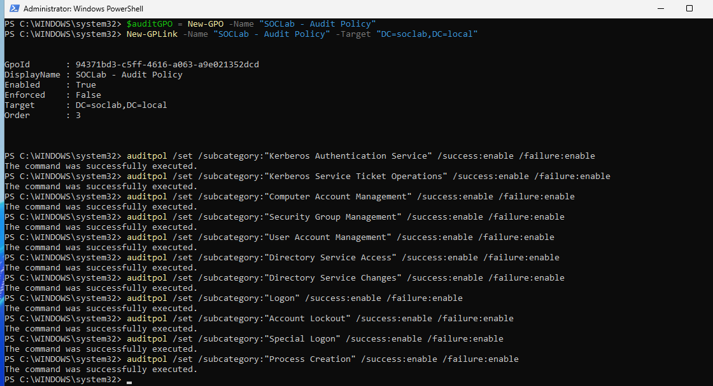

*Verified all audit policies applied correctly — these event logs feed directly into Wazuh in Phase 2.*

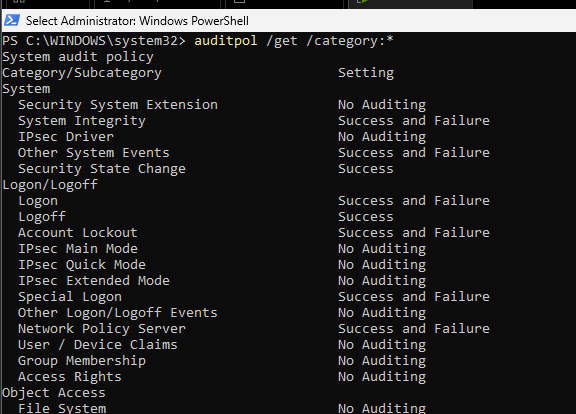

## Outcome
A fully functioning domain controller running soclab.local wiht a realistic enterprise structure. 
The domain had tiered user accounts, department-based security groups, and audit logging enabled.
The environment is ready to enroll endpoints and begin fowarding security events to the Wazuh SIEM.

## Lessons Learned
- **Windows Server ISO issue:** The initial ISO download was corrupted 
  and failed during setup with a license terms error. Re-downloading 
  the ISO from the Microsoft Evaluation Center resolved it. Always 
  verify file size after downloading large ISOs.
  
- **Disk size:** The lab guide suggested 40GB but Windows Server 2022 
  alone consumes around 20-25GB. Increased to 60GB to avoid running 
  into space issues later when adding agents and tools.
  
- **PXE boot on restart:** After the initial install the VM tried to 
  boot from the network instead of the hard disk. Fixed by disconnecting 
  the ISO from the CD/DVD drive in VMware settings so the VM booted 
  from the virtual hard disk instead.
  
