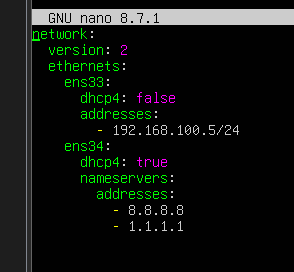
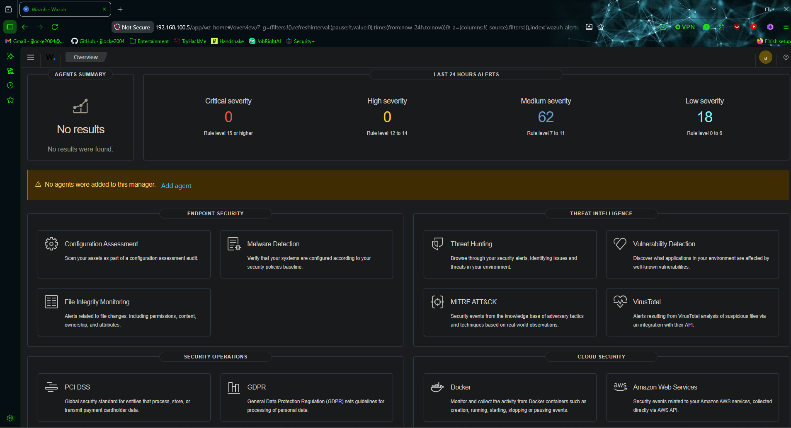
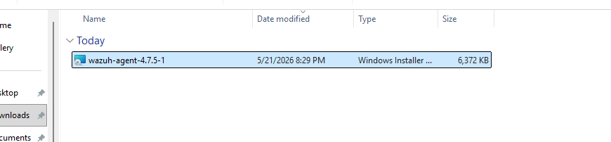
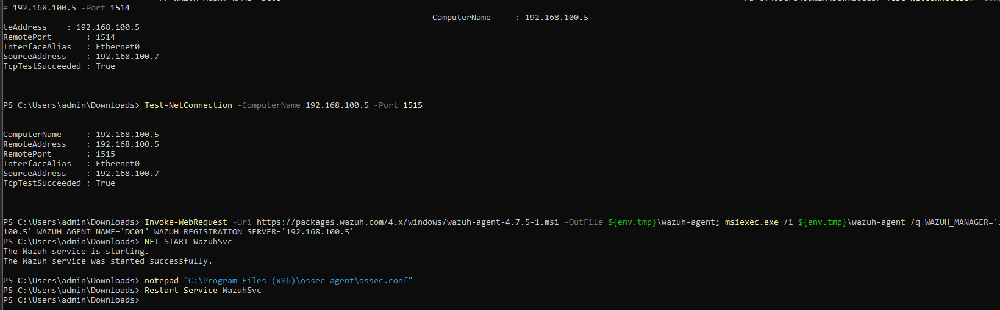
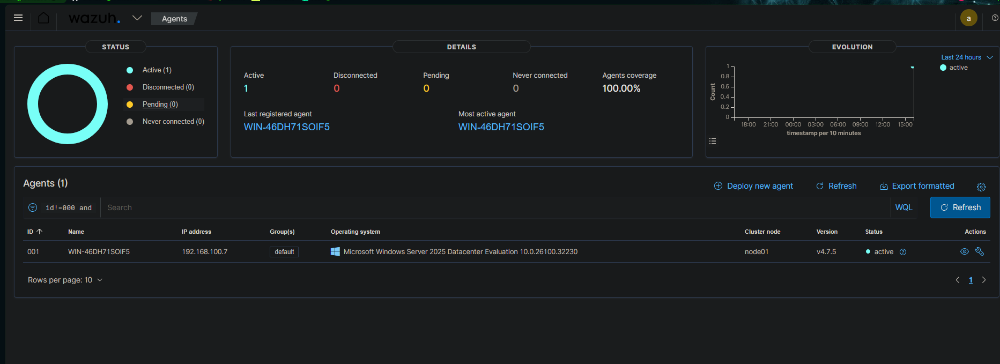
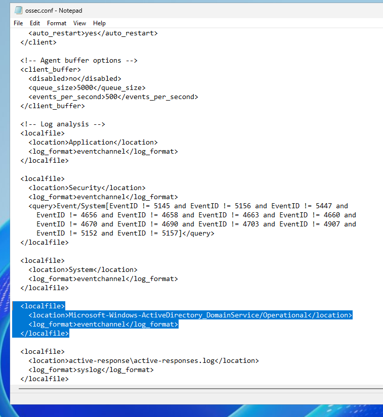
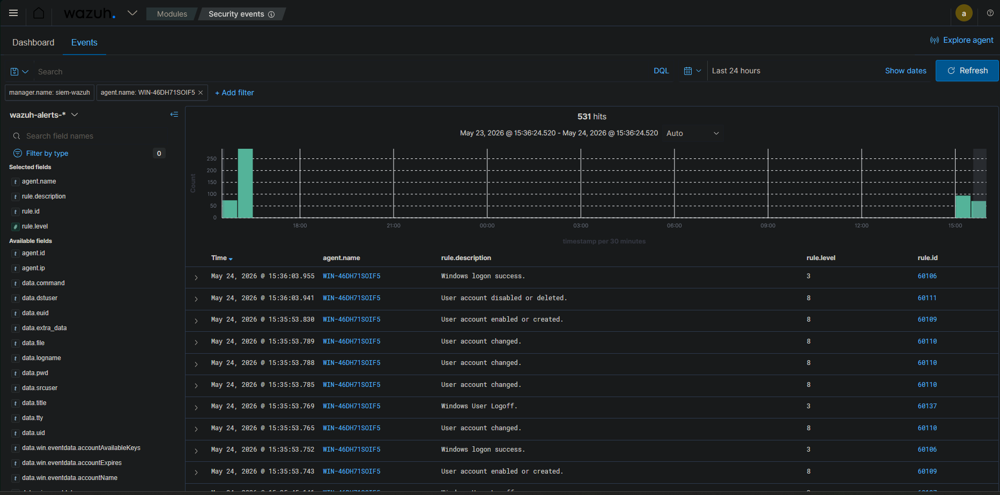
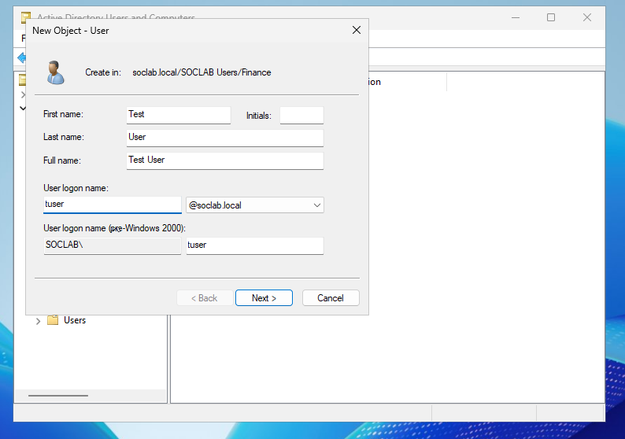
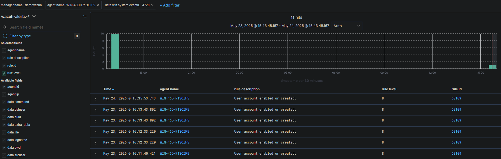
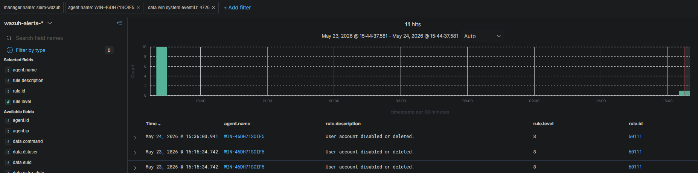

# Phase 2 — SIEM Deployment: Wazuh

## Objective
Deployed Wazuh 4.7.5 as the central SIEM for the lab on a dedicated 
Ubuntu 22.04 VM, establishing the log collection and alerting foundation 
that all subsequent phases depend on.

## Components
- **VM:** SIEM-Wazuh
- **OS:** Ubuntu 22.04 LTS Server
- **Software:** Wazuh 4.7.5 (Manager, Indexer, Dashboard)
- **IP:** 192.168.100.5

## Steps Taken
**1. Built the Ubuntu 22.04 VM**

Created a new VM in VMware with 4GB RAM, 50GB disk, and connected it to the VMnet 2 host-only network.
Assigned a static IP of 192.168.100.5 via netplan

**2. Installed Wazuh all-in-one**

Ran the official Wazuh install script which deployed the Manager, Indexer, and Dashboard components
in a single installation. Saved the auto-generated credemtials printed at the end of the install.

**3. Verified all three services**

Confirmed wazuh-manager, wazuh-indexer, and wazuh-dashboard were all running before moving on to agent enrollment.

**4. Accessed the dashboard**

Logged into the Wazuh web dashboard from the hsot machine browser at https://192.168.100.5 and confirmed the interface was live.

**5. Enrolled the domain controller agent**

Downloaded the Wazuh 4.7.5 Windows agent on the DC, installed it pointing to the manager IP, and started the WazuhSvc service.
Configured the agent ossec.conf to forward Security, System, and Directory Service event channels.

**6. Verified agent connection and log collection**

Confirmed the DC agent appeared as active in the dashboard. Created and delted a test user on the domain controller and verified
both Event ID 4720 and Event ID 4726 appeared in Wazuh within seconds, proving end-to-end log collection is working.

## Screenshots
### Netplan Configuration
*Static IP 192.168.100.5 assigned to the Wazuh VM via netplan on Ubuntu 22.04.*

### Initial Wazuh Dashboard
*Wazuh dashboard live at https://192.168.100.5 with no agents connected yet.*

### Downloading Wazuh Agent on DC
*Wazuh 4.7.5 agent MSI downloaded on the domain controller prior to installation.*

### Setting Up Wazuh Agent on DC
*Agent installed and configured with manager IP 192.168.100.5, WazuhSvc started.*

### Active Agent Confirmed
*WinServer-DC appears as an active agent in the Wazuh dashboard.*

### Agent Configuration
*Changes made to Wazuh agent ossec.conf file highlighted*

### Verify DC Traffic Collection in Wazuh
*Filtered for just DC traffic to verify log collection*

### Test User Created on AD
*Test user created on the domain controller to verify log forwarding is working.*

### Event Captured in Wazuh
*Event ID 4720 captured in Wazuh seconds after the test user was created on the DC.*

### User Deletion Log in Wazuh
*Event ID 4726 captured in Wazuh confirming the test user deletion was also logged.*

## Outcome
Wazuh 4.7.5 is completely deployed and collecting security events from the domain controller in real time.
Active Directory events including user creating, deletion, and authentication are now visible in the dashboard.
The lab now has a functioning SIEM pipeline ready to detect attacks simulated in later phases.

## Lessons Learned
- **Ubuntu version compatibility:** Initially installed Ubuntu 26.04 
  which caused the Wazuh dashboard installation to fail due to 
  incompatible dependencies. Rebuilt the VM on Ubuntu 22.04 LTS which 
  is the officially supported version and the install completed cleanly.

- **Agent version must match manager:** The agent MSI downloaded needs 
  to match the manager version exactly. Using a mismatched version 
  caused the agent to connect but not appear correctly in the dashboard. 
  Downloading the specific 4.7.5 MSI resolved it.

- **Dashboard is slow to start:** After restarting the wazuh-dashboard 
  service it takes up to 60 seconds before the browser can connect. 
  Initially mistook this for another failure — waiting the full minute 
  before troubleshooting is the right approach.
