# Phase 3 - Windows 10 Victim Endpoint

## Objective
Deployed a Windows 10 domain-joined endpoint to serve as the victim machine for attack simulations. Installed a Wazuh agent (v4.7.5) and Sysmon to enable log collection of the victim machine sent to the SIEM before attack phases begin.

## Components
- **VM:** Win10-Victim
- **OS:** Windows 10 Enterprise Evaulation
- **Domain:** soclab.local
- **IP:** 192.168.100.10
- **Wazuh Agent:** 4.7.5
- **Sysmon Config:** SwiftOnSecurity

## Steps Taken
**1. Configured Static IP and DNS**

Assigned a static IP of 192.168.100.10 and pointed DNS at the domain controller at 192.168.100.7
so the machine could resolve soclab.local for the domain join.

**2. Verified connectivity to the domain controller**

Pinged 192.168.100.7 to confirm network connectivity and ran nslookup against soclab.local to confirm DNS resolution was working before attempting the domain join.

**3. Joined the domain**

Joined the machine to soclab.local via Powershell using the Add-Computer command, authenticating with domain administrator credentials when prompted. Restarted the machine to complete the join.

**4. Installed Wazuh Agent**

Downloaded Wazuh 4.7.5 MSI via Poweshell and installed it with the manager IP set to 192.168.100.5. Started the WazuhSvc service and confirmed it was running.

**5. Installed Sysmon**
Downloaded Sysmon and the SwiftOnSecurity config file, installed with the industry standard configuration to enable deep endpoint visibility including process creation, network connections, and file events.

**6. Disabled Windows Defender real-time monitoring**

Disabled real-time monitoring and IOAV protection to allow attakc simulation payloads to execute in later phases without being quarantined before detection can be observed.

**7. Verified agent and log collection**

Confirmed Win10-Victim appeared as an active agent in the Wazuh Dashboard. Generated intentional failed logon traffic against the domain conteollert to verify event collection was working end-to-end.

## Screenshots

### Static IP Configuration
*Static IP 192.168.100.10 and Default Gateway 192.168.100.1 assigned*

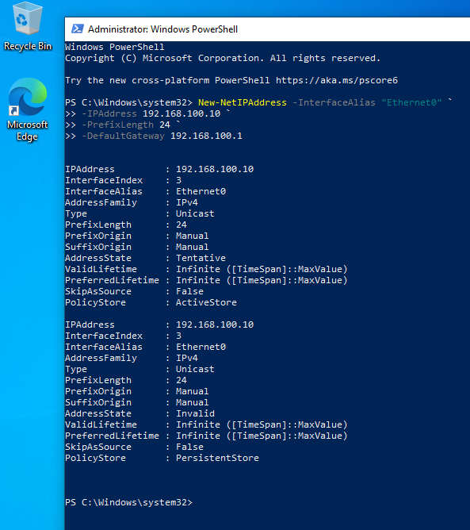

### Verifying Connectivity to Domain Controller
*DNS pointed at the DC at 192.168.100.7, confirmed ping succeeds and nslookup resolves soclab.local correctly.*

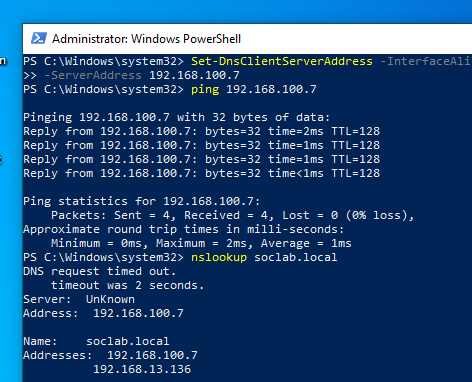

### Joining Win10 to the Domain
*Machine joined to soclab.local via System Properties using domain administrator credentials.*

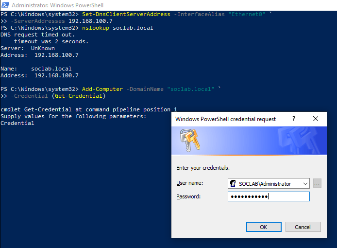

### Restarting After Domain Join
*Restarted the machine to complete the domain join process.*

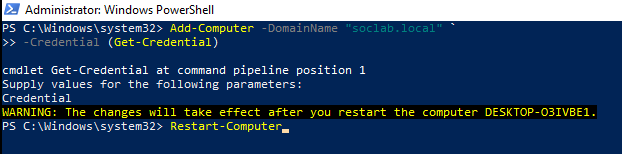

### Downloading Wazuh Agent via PowerShell
*Wazuh 4.7.5 MSI downloaded via PowerShell prior to installation.*

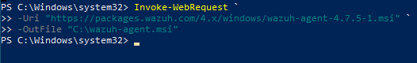

### Configuring and Starting Wazuh Agent
*Agent installed with manager IP 192.168.100.5 and WazuhSvc confirmed running.*

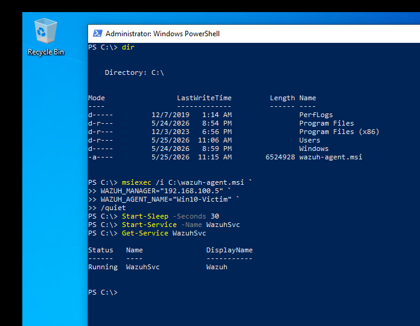

### Downloading and Installing Sysmon
*Sysmon downloaded and installed with the SwiftOnSecurity configuration for deep endpoint visibility.*

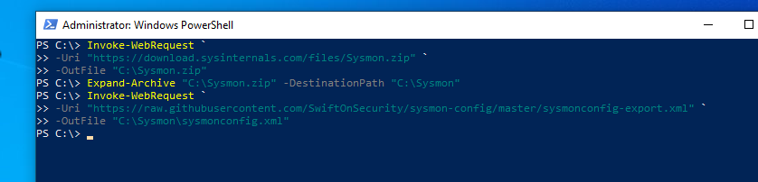

### Disabling Windows Defender
*Disabled real-time monitoring and IOAV protection to allow attack payloads to execute*

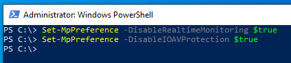

### Win10 Agent Active in Wazuh Dashboard
*Win10-Victim appears as an active agent in the Wazuh dashboard alongside WinServer-DC.*

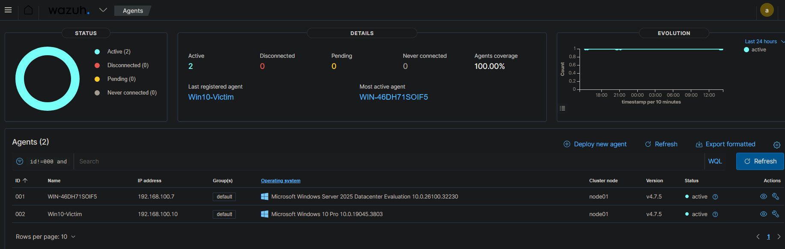

### Generating Test Traffic
*Intentional failed authentication against the DC to verify Wazuh is collecting Win10 endpoint events.*

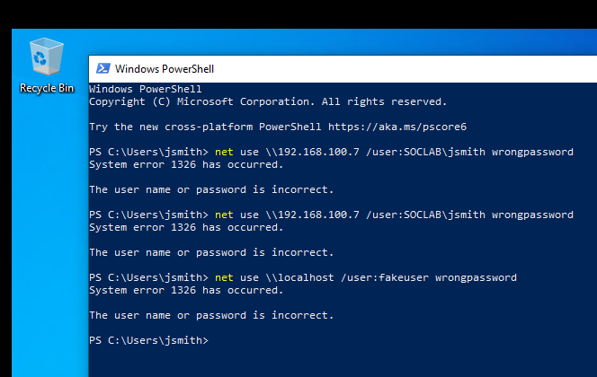

### Wazuh Capturing Traffic from Win10
*Generated failed login traffic confirmed captured in Wazuh, proving end-to-end log collection is working.*

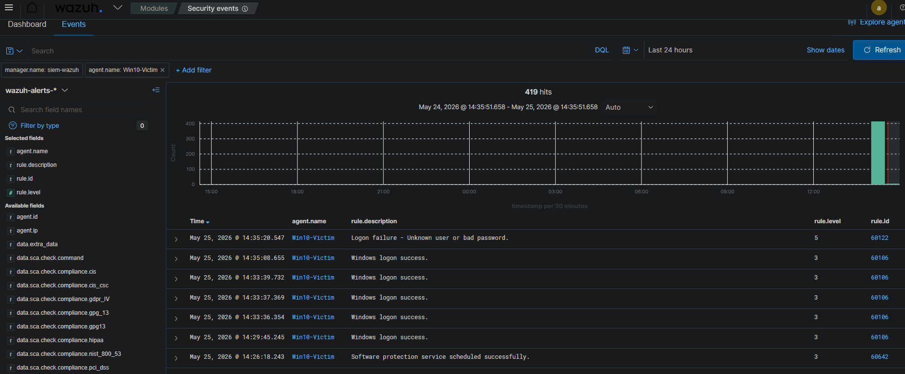

## Outcome
Windows 10 endpoint is domain-joined to soclab.local, fully monitored 
by Wazuh 4.7.5 with Sysmon providing deep process and network visibility. 
The lab now has two active agents reporting to Wazuh — WinServer-DC and 
Win10-Victim — with confirmed end-to-end log collection verified through 
live traffic generation. The environment is ready for attack simulations.

## Lesons Learned
- **Domain join via PowerShell failed:** The Add-Computer PowerShell 
  command returned "The request is not supported" repeatedly. I realized
  I was using Windows 10 Home version as opposed to Windows 10 Pro version.
  The normal Windows 10 Home version is unable to join domains which is why I ran into this issue.

- **DNS timeout was misleading:** nslookup showed "DNS request timed 
  out" but still returned the correct IP for soclab.local. This is a 
  response time warning, not an actual failure — the domain join 
  proceeded successfully once the GUI method was used.

- **Failed login events log on the DC not Win10:** When generating 
  test authentication traffic against the DC, the events appeared 
  under the WinServer-DC agent in Wazuh rather than Win10-Victim. 
  This is expected — domain authentication is handled by the DC. 
  Local authentication events against the Win10 machine itself 
  appear under the Win10-Victim agent.
